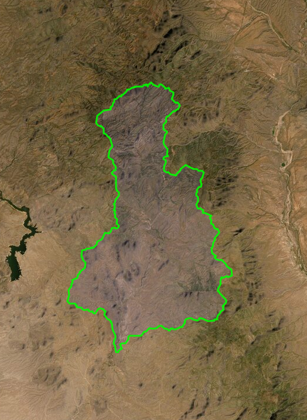

## I. overview

One of the challenges with many data repositories is the limited capacity to provide detailed metadata about data resources. A good example of this are repositories that employ the [Dublin Core](https://dublincore.org/) metadata schema. The Dublin Core schema is rich and versatile, hence why it is very widely adopted by repositories, but provides mostly for metadata about a study or dataset generally with limited capacity to describe data resources, such as tables, images, or spatial data.

We will look at three ways to generate metadata for tabular data resources to include as part of our dataset in repositories that do not otherwise provide that functionality:

- [embedded yaml](https://github.com/SOS598-RDM/rdm-lecture-metadata/blob/master/data/stream_chemistry_metadata.md#i-add-metadata-to-tabular-data-as-yaml-with-csvy)
- [frictionless](https://github.com/SOS598-RDM/rdm-lecture-metadata/blob/master/data/stream_chemistry_metadata.md#ii-frictionless)
- [README](https://github.com/SOS598-RDM/rdm-lecture-metadata/blob/master/data/stream_chemistry_metadata.md#iii-include-metadata-in-a-well-constructed-readme)

Finally, we consider providing metadata regarding non-tabular and spatial data

- [non-tabular](https://github.com/SOS598-RDM/rdm-lecture-metadata/blob/master/data/stream_chemistry_metadata.md#ii-frictionless)
- [spatial data](https://github.com/SOS598-RDM/rdm-lecture-metadata/blob/master/data/stream_chemistry_metadata.md#ii-frictionless)

## II. add metadata to tabular data as yaml with csvy

We can use the [csvy](https://github.com/leeper/csvy) R package to add metadata to a tabular resource. The output is a modified version of our tabular resource with metadata about the resource included as yaml embedded within the resource itself.

#### a simple demonstration with the iris data set

First, let us see how this works with the `iris` data.

```{r subset-iris-data}

# create our data set as a subset of the iris dataset that comes with R 
iris_subset <- head(iris) # we can 
```

We can add table-level metadata in the form of attributes to the iris_subset. As much as possible, we will employ the Frictionless [Data Table Schema](https://frictionlessdata.io/specs/table-schema/).

```{r iris-subset-table-metadata}

attr(iris_subset, "title")       <- "the famous Iris data set" # add a title
attr(iris_subset, "description") <- "measurements of Iris (Iris spp.) plants" # add a description
attr(iris_subset, "format")      <- "csvy" # add a data- meta-data format
```

We can also add field- or column-level metadata, including a title and description using attributes. Table Schema does not support metadata for units but we can include such important metadata in the description.

```{r, iris-subset-field-metadata}

attr(iris_subset$Petal.Length, "label")       <- "the length of an individual petal" # label will ultimately map to title
attr(iris_subset$Petal.Length, "description") <- "the length of an individual petal in units of millimeter" # add a description
```

How does our iris data set look (in R)?

* with the str() function...

```{r iris-subset-structure}

str(iris_subset)
```

*  with the attributes() function (note that we are excluding `row.names` from the output)...

```{r iris-subset-attributes}

attributes(iris_subset)[!names(attributes(iris_subset)) %in% c("row.names")]
```

How does our iris data set look outside of R? Here, I am writing our csvy object to a temporary (`/tmp`) directory, change the path as appropriate for your working environment.

```{r write-iris-csvy}

csvy::write_csvy(
  x = iris_subset,
  file = "/tmp/iris_subset.csv",
  comment_header = F
)
```

#### a richer example: add metadata to our stream chemistry data

Use the csvy package to add metadata to our stream chemistry data.

Import our stream chemistry data

```{r import-chem-data, warning=FALSE}

# stream_chem <- readr::read_csv(file = "stream_chemistry_metabolism.csv")
stream_chem <- read.csv(file = "stream_chemistry_metabolism.csv")
```

We can use the same approach we used with the subset of iris data for our stream chemistry data.

Add table-level metadata to our stream chemistry data.

```{r stream-chem-metadata}

attr(stream_chem, "title")       <- "stream chemistry data from southern Appalachian mountain streams, 2013" # add a title
attr(stream_chem, "description") <- "stream chemistry data for the calculation of ecosystem metabolism collected with automated data loggers from four headwater streams in the southern Appalachian mountain region during summer 2013" # add a description
attr(stream_chem, "format")      <- "csvy" # add a (meta)data format
```

Add table-level metadata to our stream chemistry data.

```{r}

attr(stream_chem$site_id, "label")       <- "study site identifier"
attr(stream_chem$site_id, "description") <- "site-code: Greenbriar (GB), Stone Crop (SC), Hugh White Creek (HWC)"

attr(stream_chem$K2_20, "label")         <- "a metric of oxygen exchange across the air-water interface"
attr(stream_chem$K2_20, "description")   <- "oxygen reaeration coefficient (per day)"

attr(stream_chem$Date, "label")          <- "date of observation"
attr(stream_chem$Date, "description")    <- "date of observation (YYYY-MM-DD)"

attr(stream_chem$Time, "label")          <- "time of observation"
attr(stream_chem$Time, "description")    <- "time of observation (hh:mm:ss)"

attr(stream_chem$Temp, "label")          <- "stream water temperature"
attr(stream_chem$Temp, "description")    <- "stream water temperature (degrees Celsius)"

attr(stream_chem$SpCond, "label")        <- "stream water specific conductance"
attr(stream_chem$SpCond, "description")  <- "stream water specific conductance (microSiemens per centimeter)"

attr(stream_chem$DO, "label")            <- "stream water dissolved oxygen concentration"
attr(stream_chem$DO, "description")      <- "stream water dissolved oxygen concentration (milligrams per liter)"
```

Review our stream chemistry metadata

* with the str() function...

```{r stream-chem-str}

str(stream_chem)
```

*  with the attributes() function (note that we are excluding `row.names` from the output)...

```{r stream-chem-attributes}

attributes(stream_chem)[!names(attributes(stream_chem)) %in% c("row.names")]
```

Write our stream chemistry data as a csvy file with metadata. Here, I am writing our csvy object to a temporary (/tmp) directory, change the path as appropriate for your working environment.

```{r write_stream_chem}

csvy::write_csvy(
  x = stream_chem, 
  file = "/tmp/stream_chem.csv",
  comment_header = F,
  row.names = F
)
```

## II. frictionless

### a. use the frictionless web-based data package creator

We can use the frictionless data package [creator](https://create.frictionlessdata.io/) to construct an entire data package. Metadata are contained in the `stream-chem-data-package.json` file in the `data` directory of this repository; this can be uploaded along with the data file `stream_chemistry_metabolism.csv` or bundled as a stand-alone data package.

### b. use frictionless tools to generate metadata or create a data package

Load an existing schema into our R environment and display output. Note that the full path to the file is required for Package.load hence use of the call to `here`.

```{r load-display-stream-chem-json, echo=TRUE}

streamChemPackage <- datapackage.r::Package.load(here::here("data", "stream-chem-data-package.json"))
jsonlite::toJSON(streamChemPackage$descriptor, pretty = T)
```

## III. include metadata in a well-constructed README

Another less technical, though not necessarily less effective, approach is to simply document the details of a data resource in a document. A good example of such documentation is a study by [Wall et al. 2017](https://datadryad.org/stash/dataset/doi:10.5061/dryad.5vg70) that is in the Dryad repository. Note that Wall et al. provide details of the data tables by describing the content of those tables in corresponding .docx files. docx is *definitely* not the best medium for such documentation, plain text is most appropriate, but the documentation is thorough and understandable.

## IV. non-tabular data

Except for csvy, we can use similar approaches to documenting non-tabular data. For example, we could use the [frictionless data package creator](https://create.frictionlessdata.io/) to generate metadata for an image.

```r

# knitr::include_graphics("syc_ss_mapview.png", fig.cap = "Catchment above Dos S Ranch on Sycamore Creek, AZ")
```

The corresponding metadata generated from frictionless is displayed below.

```{r load-sycamore-creek-catchment-json, echo=TRUE}

sycamore_creek_catchment <- datapackage.r::Package.load(here::here("data", "sycamore-creek-catchment.json"))
jsonlite::toJSON(sycamore_creek_catchment$descriptor, pretty = T)
```

## V. non-tabular data: spatial data

Common packages for working with spatial data, such as QGIS and ArcGIS, have their own tools for generating metadata. These metadata can be embedded in the spatial resource, such that the data file includes both the spatial data and corresponding metadata. This can be good and bad. On one hand, it is convenient and efficient to have both data and metadata in one file resource but, on the other, this means that it is possible that the software used to generate the resource (e.g., ArcGIS) is the only way to access one or both components.

If this is a concern, and it is something that the data provider should consider, the spatial data can be provided in an open format, such as kml or geojson, with the metadata generated separately. For example, below are the first few lines of the file `headwater_catchments_new_mexico.qmd` that includes metadata corresponding to the `new_mexico_ws.geojson` spatial data file in our `data` directory. `headwater_catchments_new_mexico.qmd` was generated in QGIS, hence the `qmd` extension, but this is a plain-text format that is easily accessible.

```{r , eval=TRUE}

readLines(
  con = "headwater_catchments_new_mexico.qmd",
  n = 10
)
```
