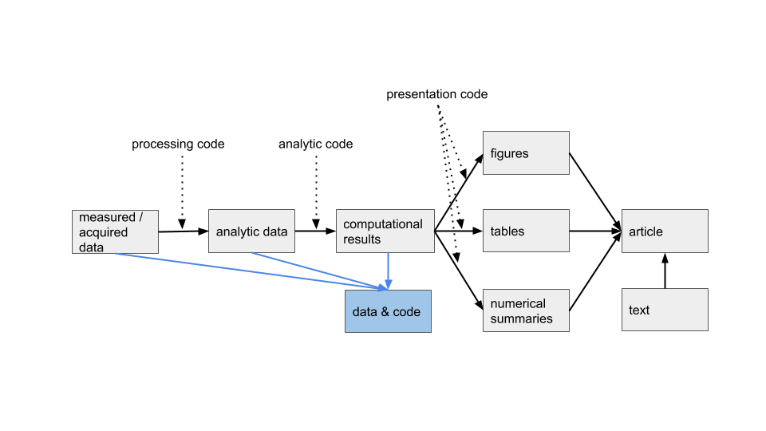
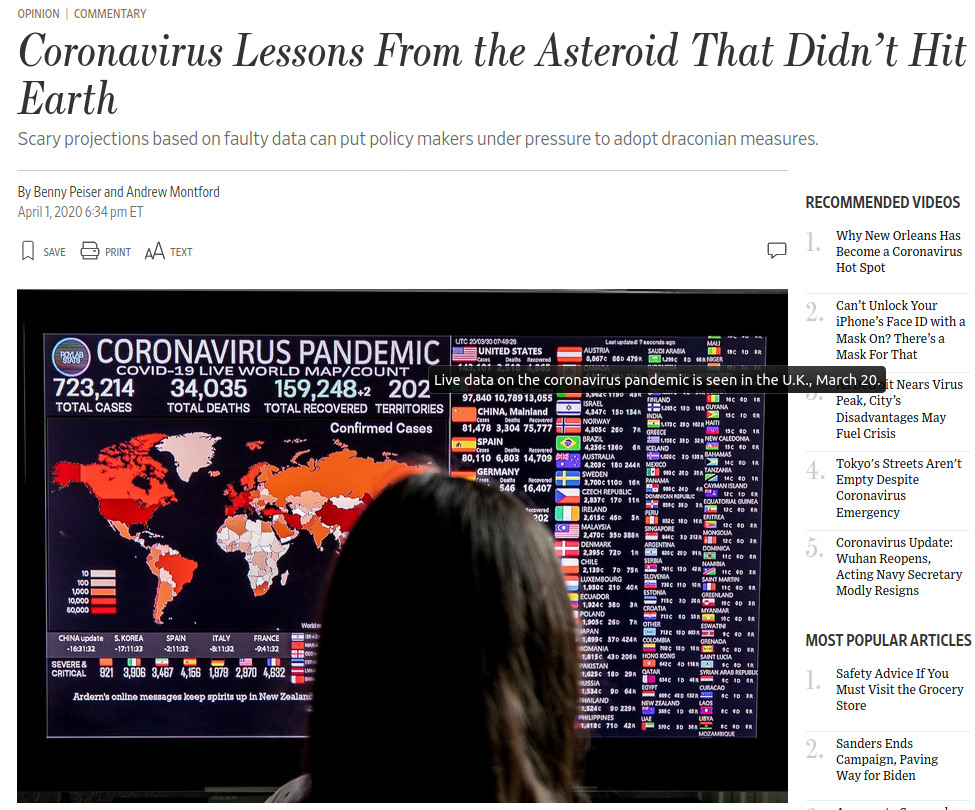
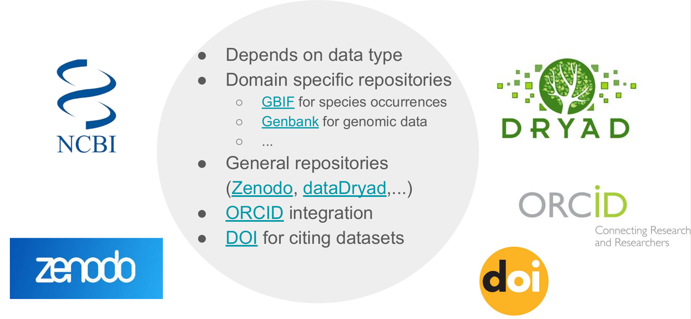
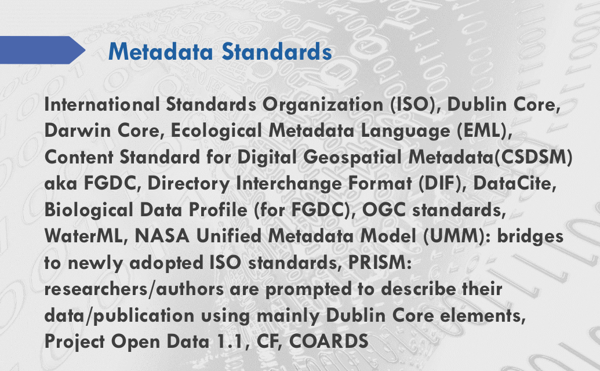

#### research data workflow: this is your world (or it will be soon) - .light-blue[now add to that publishing your data and code]



.footnote[J. Bryan from http://stat545.com/]

---
background-image: url('assets/figures/whypublish.png')
background-size: 90%

#### why publish data


.footnote[[Milotić](https://speakerdeck.com/milotictanja/good-enough-practices-in-data-management)]

???

* big picture
  + increasingly a requirement
  + advancement of science
  
* researcher perspective
  + papers with publicly available data receive a higher number of citations than similar studies lacking available data<sup>1</sup>
  + data sharing is associated with higher productivity
  + a citeable product
  

---

.pull-left[
  
]

.pull-right[

"The climate scientists at the centre of a media storm over leaked emails were yesterday cleared of accusations that they fudged their results and silenced critics, but a review found they had failed to be open enough about their work."
]

.footnote[[NCEAS crescynt training](https://nceas.github.io/crescynt-training/)]

???

#### climategate

---

#### concerns about sharing data

most common concerns can be addressed *with metadata*

.pull-left[
.center[**concern**]

<hr>

* inappropriate use due to misunderstanding of research purpose or parameters

* security and confidentiality of sensitive data

* lack of acknowledgement / credit

]

.pull-right[
.center[**solution**]

<hr>

* provide rich abstract, purpose, use constraints, and supplemental information

* use constraints to specify who may access the data and how

* specify a required data citation within the use constraints

]

.footnote[[DataONE](https://www.dataone.org/education-modules)]


---
class: inverse

<br>
<br>
<br>

**"Without clear instructions, many researchers struggle to avoid chaos in their file structures, and so are understandably reluctant to expose their workflow for others to see.  This may be one of the reasons that so many requests for details about method, including requests for data and code, are turned down or go unanswered (Collberg & Proebsting 2016)."**

.footnote[[Marwick et al. 2018](https://doi.org/10.1080/00031305.2017.1375986)]

???

#### avoid chaos

---

.pull-left[
  
]

.pull-right[

<small>
  Several researchers have apparently asked to see Imperial's calculations, but
  Prof. Neil Ferguson, the man leading the team, has said that <mark>the
  computer code is 13 years old and thousands of lines of it "undocumented,"
  making it hard for anyone to work with, let alone take it apart to identify
  potential errors</mark>. He has promised that it will be published in a week
  or so, but in the meantime reasonable people might wonder whether something
  made with 13-year-old, undocumented computer code should be used to justify
  shutting down the economy. Meanwhile, the authors of the Oxford model have
  promised that their code will be published "as soon as possible."
</small>
]

.footnote[[Wall Street Journal](https://www.wsj.com/articles/coronavirus-lessons-from-the-asteroid-that-didnt-hit-earth-11585780465)]

???

#### covid19

---
background-image: url('assets/figures/fair.png')
background-size: 90%

.footnote[[Milotić](https://speakerdeck.com/milotictanja/good-enough-practices-in-data-management)]

???

#### FAIR

---

#### where to publish data?

data repository: long-term | versioned | citeable | discoverable

.center[
  
]

`r emo::ji("prohibited")`: Dropbox | Google Drive | LinkedIn | ResearchGate | websites | etc.

.footnote[[Milotić](https://speakerdeck.com/milotictanja/good-enough-practices-in-data-management)]


---

#### where to publish data?

<br>
<br>

.center[
  
]

is awesome but I would start with...
* institutional resources
* lab, colleagues
* conferences


---
class: inverse

<br>
<br>
<br>

**"data without the contextual information needed to interpret it (and ultimately reproduce the results) is useless"**

.footnote[[Metadata for Research Data by Brianna Marshall](https://speakerdeck.com/bmarshall/metadata-for-research-data)]


???

#### context is essential

---

#### metadata: the who, what, why, where, when

- principal investigator
- funding sources
- data collector/producer
- project description
- sample and sampling procedures
- weighting
- substantive, temporal, and geographic coverage of the data collection
- data source(s)
- unit(s) of analysis/observation
- variables
- technical information on files
- data collection instruments

.footnote[[Metadata for Research Data by Brianna Marshall](https://speakerdeck.com/bmarshall/metadata-for-research-data)]


---

#### what makes good metatadata?

- consistency with commonly used fields, e.g., YYYY-MM-DD
- use a standard vocubulary
- spell out acronyms
- provide all the critical information for: *identification; entities and attributes; data quality; data lineage; access, use, and liability constraints; accessing the data; spatial reference*
- complete title: who, what, when, where, and scale
- be specific, and quantify where possible
- use descriptive and clear writing
- fully document geographic locations
- use keywords wisely (use a thesausus when possible)
- detail, there is no such thing as too much!
- remember that a computer will read this:
  + avoid special characters
  + avoid tabs, indents, carriage returns
  + copy from a text file (not a file with rich text like Word or RTF)


.footnote[[DataONE](https://www.dataone.org/education-modules)]


---

#### a special note about titles

.center[
  
]


---

#### metadata standards: what is a standard?

standards provides a structure to describe data with:
- common terms to allow consistency between records
- common definitions for easier interpretation
- common language for ease of communication
- common structure to quickly locate information

in search and retrieval, standards provide:
- documentation structure in a reliable and predictable format for computer interpretation
- a uniform summary description of the dataset

<!-- <p style="color:#00BFFF">...like a blueprint for the structure of information</p> -->

.footnote[[DataONE](https://www.dataone.org/education-modules)]


---

#### metadata standards: blueprint (for a house)

*example for a house*

.less-left[
```
house:
  parcel_number:
  roof:
    type: shingle, shake,
          tile
    color:
  wall:
    exterior_wall:
      type: block, vinyl,
            stucco
      color:
    interior_wall:
      color:
```
]

.more-right[
```xml
<house>
  <parcel_number>45.658</parcel_number>
  <roof>
    <type>tile</type>
    <color>rustic red</color>
  </roof>
  <wall>
    <exterior_wall>
      <type>block</type>
      <color>swiss coffee</color>
    </exterior_wall>
    <interior_wall>
      <color>almond butter</color>
    </interior_wall>
 </wall>
</house>
```
]


---

#### metadata standards: blueprint (for a plant feature)

*example for ecological data*

```xml
<attribute>
  <attributeName>stem_diameter</attributeName>
  <attributeDefinition>stem diameter</attributeDefinition>
  <storageType>float</storageType>
  <measurementScale>
    <ratio>
      <unit>
        <standardUnit>centimeter</standardUnit>
      </unit>
      <numericDomain>
        <numberType>real</numberType>
      </numericDomain>
    </ratio>
  </measurementScale>
  <missingValueCode>
    <code>NA</code>
    <codeExplanation>missing value</codeExplanation>
  </missingValueCode>
</attribute>
```

---

#### metadata standards: there are a lot




---

#### license

.light-grey["...have a license file in the project's home directory that clearly states what license(s) apply to the project's software, data, and manuscripts. Lack of an explicit license does not mean there isn't one; rather, it implies the author is keeping all rights and others are not allowed to reuse or modify the material.] We recommend Creative Commons licenses for data and text, either CC-0 (the "No Rights Reserved" license) .light-grey[or CC-BY (the "Attribution" license, which permits sharing and reuse but requires people to give appropriate credit to the creators). For software, we recommend a permissive open source license such as the MIT, BSD, or Apache license..."]

.footnote[Wilson et al. 2017 [Good enough practices in scientific computing](https://doi.org/10.1371/journal.pcbi.1005510)]

---

#### orcid

.center[
  
]

[orcid.org](https://orcid.org/)
