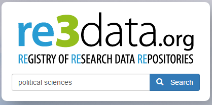

```{r setup, include=FALSE}
options(htmltools.dir.version = FALSE)
```


# why publish data

* big picture
  + increasingly a requirement
  + advancement of science
  
* researcher perspective
  + papers with publicly available data receive a higher number of citations than similar studies lacking available data<sup>1</sup>
  + data sharing is associated with higher productivity<sup>1</sup>
  + <a href="https://portal.lternet.edu/nis/mapbrowse?packageid=knb-lter-cap.621.1" target="_blank">a citeable product</a>
  
.footnote[Marwick et al. 2017. https://doi.org/10.7287/peerj.preprints.3192v1]

---

.center[

  
  
  "The climate scientists at the centre of a media storm over leaked emails were yesterday cleared of accusations that they fudged their results and silenced critics, but a review found they had failed to be open enough about their work."
]

.footnote[https://nceas.github.io/crescynt-training/]


---

# concerns about sharing data

most common concerns can be easily addressed *with metadata*

.pull-left[
.center[**concern**]

<hr>

* inappropriate use due to misunderstanding of research purpose or parameters

* security and confidentiality of sensitive data

* lack of acknowledgement / credit

]

.pull-right[
.center[**solution**]

<hr>

* provide rich abstract, purpose, use constraints, and supplemental information

* use constraints to specify who may access the data and how

* specify a required data citation within the use constraints

]

.footnote[https://www.dataone.org/education-modules]


---

<br>
<br>
<br>

**"Without clear instructions, many researchers struggle to avoid chaos in their file structures, and so are understandably reluctant to expose their workflow for others to see.  This may be one of the reasons that so many requests for details about method, including requests for data and code, are turned down or go unanswered (Collberg & Proebsting 2016)."**

.footnote[Marwick et al. 2017. https://doi.org/10.7287/peerj.preprints.3192v1]


---

# what do we mean by data repository?

```{r echo=FALSE}
dataRepo <- data.frame(
  system = c("Google Drive", "GitHub", "University Server", "KNB"),
  `long term` = c("maybe", "yes", "maybe", "yes"),
  versioned = c("maybe", "yes", "no", "yes"),
  citable = c("no", "no", "no", "yes"),
  discoverable = c("no", "no", "maybe", "yes")
)

knitr::kable(dataRepo, format = "html")
```


.footnote[https://nceas.github.io/crescynt-training/]


---

# where to publish?

.center[

]

totally awesome but a journal may guide you, and I would start first with lab, colleagues, at conferences


---

# data standards: there are a lot


---

# data standards: what is a standard?

standards provides a structure to describe data with:
- common terms to allow consistency between records
- common definitions for easier interpretation
- common language for ease of communication
- common structure to quickly locate information

in search and retrieval, standards provide:
- documentation structure in a reliable and predictable format for computer interpretation
- a uniform summary description of the dataset

<p style="color:#00BFFF">...like a blueprint for the structure of information</p>

.footnote[https://www.dataone.org/education-modules]


---

# xml structure

```xml
<attribute>
  <attributeName>stem_diameter</attributeName>
  <attributeDefinition>stem diameter</attributeDefinition>
  <storageType>float</storageType>
  <measurementScale>
    <ratio>
      <unit>
        <standardUnit>centimeter</standardUnit>
      </unit>
      <numericDomain>
        <numberType>real</numberType>
      </numericDomain>
    </ratio>
  </measurementScale>
  <missingValueCode>
    <code>NA</code>
    <codeExplanation>missing value</codeExplanation>
  </missingValueCode>
</attribute>
```


---

# the who, what, why, where, when

- principal investigator
- funding sources
- data collector/producer
- project description
- sample and sampling procedures
- weighting
- substantive, temporal, and geographic coverage of the data collection
- data source(s)
- unit(s) of analysis/observation
- variables
- technical information on files
- data collection instruments

.footnote[adapted from ICPSR by Brianna Marshall from Metadata for Research Data]


---

<br>
<br>
<br>

**"data without the contextual information needed to interpret it (and ultimately reproduce the results) is useless"**

.footnote[from Metadata for Research Data by Brianna Marshall]


---

# what makes good metatadata?

- consistency with commonly used fields, e.g., YYYY-MM-DD
- use a standard vocubulary
- spell out acronyms
- provide all the critical information for: <i>identification; entities and attributes; data quality; data lineage; access, use, and liability constraints; accessing the data; spatial referencewriting quality metadata</i>
- complete title: who, what, when, where, and scale
- be specific, and quantify where possible
- use descriptive and clear writing
- fully document geographic locations
- use keywords wisely (use a thesausus when possible)
- detail, there is no such thing as too much!
- remember that a computer will read this:
  + avoid special characters
  + avoid tabs, indents, carriage returns
  + copy from a text editor (not a word processor)


.footnote[https://www.dataone.org/education-modules]

---

# a special note about titles


---

# orcid

.center[

]

[orcid.org](https://orcid.org/)